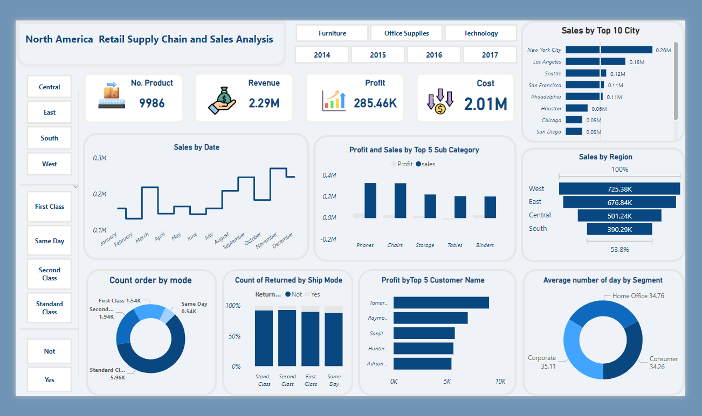

# Etl and Date Warehouse project

## **Table of Contents**
* **Project Overview**
* **Technologies Used**
* **Project Structure**
* **ETL Process**
* **Usage**

## **Project Overview**
### **Data Extraction:**
* Extracting the data from the source spreadsheet or file.
* Assessing data quality, consistency, and completeness.

### **Data Transformation:**
* Cleaning and preprocessing the data to address missing values, duplicates, and anomalies.
* Structuring the data for analytical purposes, including creating facts and dimensions.

### **Data Loading:**

* Loading the transformed data into a suitable database or data storage solution, such as a relational database (e.g., PostgreSQL) or a data warehousing platform (e.g., Snowflake).

### **Data Warehouse Schema Design:**

* Designing a schema for the Data Warehouse, including fact tables and dimension tables to support analytical queries.
* Ensuring that the schema is optimized for query performance.

### **ETL (Extract, Transform, Load) Process:**

* Implementing an ETL process to automate data extraction, transformation, and loading.
* Scheduling ETL jobs to keep the Data Warehouse up-to-date with the latest data.
### **Data Analysis Tools Integration:**

* Integrating data analysis tools such as Power BI, Tableau, or Jupyter Notebooks to connect to the Data Warehouse and perform in-depth analysis.

## **Technologies Used**

**Database** : PostgreSQL

**ETL Tool** : Pentaho

**Dashboard** : Power BI


## **Project Structure**
```
project-root/
│
├── Dashboard/
│   ├── Dashboard.pbix
│   ├── Dashboard.png
|
├── Data Warehouse/
│   ├── date dim.ktr
│   ├── location dim.ktr
│   ├── mode dim.ktr
|   ├── Coustomer dim.ktr
|   ├── Product dim.ktr
|   ├── Sales  Fact.ktr
|   ├── DataWarehouse job.kjb
│
├── Database/
│   ├── Sql Script.sql
│
├── Data/
│   ├── Data Source(Divided and full)
│   ├── Calender Date
│
└── README.md
``````
## **ETL Process**
**Create dim Coustomer Data From Data Source to database**

**Create dim Date Date From Data Source to database**

**Create dim Ship Mode Data From Data Source to database**

**Create dim location Data From Data Source to database**

**Create dim Product Data From Data Source to database**

**Create Fact Sales Table**

**Create job ETl To Extract Data always**


**Star Sehema**


## **Usage**

### **Create a report allows end-users to find answers to the following questions:**
* Which City/State had the best retail supply chain management?
* What was the average delivery days for different product category?
* What was the average delivery days for each segment?
* What were the 5 fastest delivery products?
* What were the 5 slowest delivery products?
* Can we find the correlation between ship mode and return rate?
* Which top 5 customers made the most profit? 




